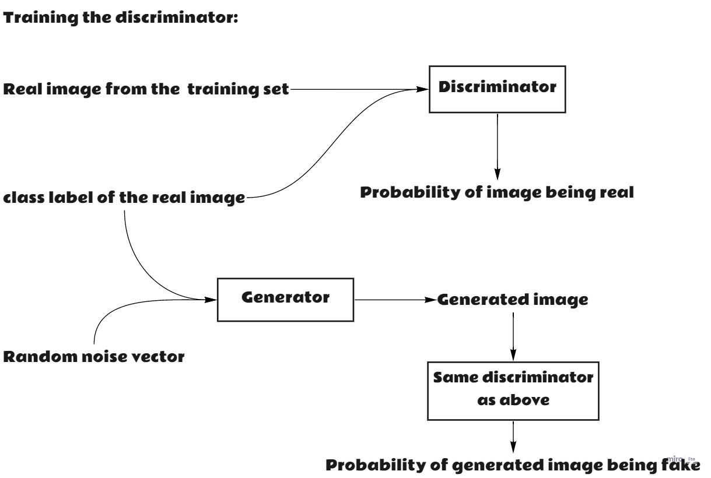
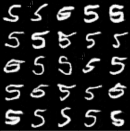

# Conditional DCGAN 
Conditional Deep Convolutional Generative Adversarial Networks (cDCGAN) for generation of handwritten digits using PyTorch.

## What is a Conditional DCGAN?
It is a type of Generative Adversarial Network that uses a random noise vector and a class label to output an image of the specified class.

## Why conditional GAN?
Let's assume we trained a simple GAN on MNIST digits. After training, we want the GAN to generate a handwritten digit 7. There is no way we can tell the trained GAN to do so. We will have to let the trained GAN generate digits until the generated digit is of a handwritten digit 7. If we have a labeled training set, we can use the labels to train a GAN. After training, the GAN will be able to output an image of the specified class.

## How to train a conditional GAN?
Firstly, we need to have a labeled dataset, that is, each image in the dataset should have a class assigned to it. To train the generator, we need to train the discriminator with the generator. The discriminator guides the generator to produce realistic-looking images. Due to this, the generator improves over time.

Given a random class label, the generator tries to output a realistic-looking image of that class. The discriminator looks at the generated image and the class label that was given to the generator to output the current image. Now, the discriminator is asked, how realistic is the image based on the class label? The discriminator answers by giving a probability of being real to the generated image. Using the assigned probability, the loss value is calculated using the BCE loss function. With the goal of decreasing the calculated loss value, the generator's weights are updated. The generator wants to fool the discriminator, that is, it wants the discriminator to think the generated image is 100% real.

An image is picked from the training set with the correct class label and given to the discriminator. The discriminator is asked, how realistic is the input image based on the class label? The discriminator answers by giving a probability of being real to the image picked from the training set.
The same process is repeated for the image produced by the generator. The only difference is that this time we ask the discriminator, how fake is the input image based on the input class label? Using the assigned probabilities, the loss value is calculated using the BCE loss function. With the goal of decreasing the calculated loss value, the discriminator's weights are updated. The discriminator wants to classify both the images correctly, that is, it should be completely sure that the generated image is a fake image and the image from the training set is a real image.

Note that the generator and the discriminator are trained on batches, not just on one training image in a single forward pass.

The discriminator is given the task of classifying the images to be fake or real, whereas, the generator has to create a whole image which it doesn't even have access to and has to just rely on the discriminator's feedback. Due to this, the discriminator gets good at the task assigned to it faster than the generator, and problems like mode collapse, and vanishing gradients are commonly seen while training with BCE loss function. But following the architecture guidelines mentioned in the DCGAN paper, the training is stable for this task.

## Results
After training, the trained cDCGAN outputs images shown below when giving it a class label of 0-9 for every forward pass.

	
	
	
	
	
	
	
	
	
	

## Use the trained model
Link to google notebook to try out the trained model: [cDCGAN to generate handwritten digits](https://colab.research.google.com/drive/1Uzd6BZ0wo5C212cYpKDnsD3mwt1QZCFU?usp=sharing)

## Train a cDCGAN to generate handwritten digits
Google notebook: [Train cDCGAN on handwritten digits](https://colab.research.google.com/drive/1kUluaJ5fKhcUHbR2Bl0MI5CdvzVQ9P8i?usp=sharing)

Feel free to change any of the settings

## References
* [Unsupervised Representation Learning with Deep Convolutional Generative Adversarial Networks](https://arxiv.org/pdf/1511.06434.pdf)
* [Build basic GANs (Paid course)](https://www.coursera.org/learn/build-basic-generative-adversarial-networks-gans)